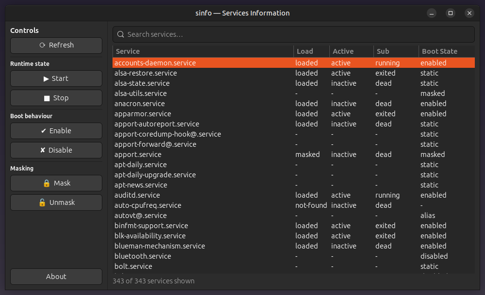

<div align="center">

<a href="https://github.com/effjy/sinfo/"></a>

A clean **GTK4** front-end for listing and managing **systemd services**.


</div>

---

## Overview

**sinfo** lists every service known to your machine and lets you control them from
a tidy graphical window — no terminal required. Controls live on the left, the
service list fills the right, and the whole window is laid out horizontally so it
sits comfortably on a standard screen.

Privileged operations are never run with ambient root: each action is elevated
individually through **`pkexec` (polkit)**, so you authenticate per-operation just
like the rest of your desktop.

## Features

- 📋 **List** all services on the machine (loaded units + installed unit files)
- ▶ **Start** / ■ **Stop** services
- ✔ **Enable** / ✘ **Disable** services at boot
- 🔒 **Mask** / 🔓 **Unmask** services
- 🔎 **Live search / filter** as you type
- 🔐 Privileged actions performed safely via **pkexec**
- 🖥️ Horizontal layout — controls on the left, services on the right

## Screenshot



## Prerequisites

You need a C++17 toolchain, the **gtkmm-4.0** development files, **polkit**
(`pkexec`) and **systemd**.

### Debian / Ubuntu

```bash
sudo apt install build-essential pkg-config libgtkmm-4.0-dev policykit-1
```

### Fedora

```bash
sudo dnf install gcc-c++ make pkgconf-pkg-config gtkmm4.0-devel polkit
```

### Arch Linux

```bash
sudo pacman -S base-devel gtkmm-4.0 polkit
```

> `systemd` and `pkexec` are already present on virtually every modern Linux
> desktop, so usually only the build tools and **gtkmm-4.0** need installing.

## Build & Install

```bash
git clone https://github.com/effjy/sinfo.git
cd sinfo
make
sudo make install
```

`sudo make install` places:

| File | Destination |
|------|-------------|
| `sinfo` binary | `/usr/bin/sinfo` |
| Desktop entry  | `/usr/share/applications/org.effjy.sinfo.desktop` |
| Application icon | `/usr/share/icons/hicolor/scalable/apps/sinfo.svg` |

The icon cache and desktop database are refreshed automatically, so the icon
shows up in your application launcher and in the window/taskbar while running.

### Uninstall

```bash
sudo make uninstall
```

## Usage

sinfo is a **graphical, front-end-only** application.

1. Launch it from your application menu (**Services Information**) or run `sinfo`.
2. Browse the service list on the right; type in the search box to filter.
3. Click a service to select it.
4. Use the controls on the left to act on the selection:
   - **Start / Stop** — change the current runtime state
   - **Enable / Disable** — change whether it starts at boot
   - **Mask / Unmask** — fully block / unblock a service
5. When an action needs root, a **polkit (pkexec)** dialog asks for authentication.
6. Hit **Refresh** any time to re-read the current state, or **About** for info.

## About

| | |
|---|---|
| **Program** | Services Information (`sinfo`) |
| **Version** | 1.0.1 |
| **Author** | Jean-Francois Lachance-Caumartin |
| **Repository** | https://github.com/effjy/sinfo/ |
| **License** | MIT |

## License

Released under the **MIT License** — see [`LICENSE`](LICENSE).
